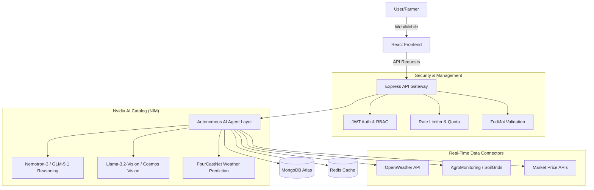

# Comprehensive Development Plan: AI Crop Advisory Platform Enhancement

## 1. Executive Summary
This document outlines a comprehensive plan to enhance the AI Crop Advisory Platform, transforming it from its current state of partial completion and heuristic-based AI to an enterprise-grade application powered by advanced Nvidia AI models and robust security measures. The primary goal is to integrate autonomous AI logic for real-time, accurate agricultural advice, addressing current limitations in AI integration, security, and scalability.

## 2. Technical Audit Findings

### 2.1. Current AI/ML Integration
The platform currently utilizes a **Vite + React + TypeScript** frontend and an **Express + MongoDB** backend. The existing AI/ML integration primarily relies on `AIMLAPI` (aimlapi.com) as a wrapper. A deep dive into the backend logic, particularly in `src/server/routes/pest.js` and `src/server/routes/soil.js`, reveals that most 
AI features are implemented using **deterministic heuristics** or **hardcoded data**, rather than actual AI model inferences. Furthermore, critical API keys for services like AIMLAPI, OpenWeather, Trefle, and Plant.id are often **hardcoded as fallbacks** in both frontend and backend code, posing significant security risks. Some AI logic is also client-side, leading to architectural inconsistencies and potential exposure of sensitive information.

### 2.2. Security & Infrastructure Analysis
An audit of the existing codebase identified several security vulnerabilities and infrastructure gaps:

*   **Authentication:** The JWT authentication middleware in `src/server/middleware/auth.js` contains a critical flaw where errors during token verification are re-thrown instead of returning a proper 401 Unauthorized response. This can lead to unhandled exceptions, potential server crashes, or information leakage.
*   **Rate Limiting:** While a basic rate-limiting mechanism is present in `src/server/index.js`, it is not sufficiently granular or robust for enterprise-level protection, especially for computationally intensive AI endpoints.
*   **Input Validation:** Input validation is inconsistent across different routes, with some endpoints lacking comprehensive checks, making the system vulnerable to injection attacks and malformed data.
*   **Hardcoded Secrets:** The pervasive use of hardcoded API keys and secrets throughout the codebase presents a severe risk of credential compromise.

## 3. Proposed Enhancements with Nvidia AI Catalog
To address the identified gaps and elevate the platform to an enterprise standard, we propose integrating advanced AI models from the Nvidia AI Catalog (NIM) and implementing autonomous AI logic.

### 3.1. Autonomous AI Logic
The current system's reliance on static data and heuristics will be replaced with a dynamic, **autonomous AI agent layer**. This agent will be capable of:

*   **Real-time Data Integration:** Continuously ingesting and processing real-time data from various sources (weather, soil, market prices).
*   **Contextual Reasoning:** Utilizing advanced reasoning models to understand complex agricultural scenarios and provide tailored advice.
*   **Proactive Recommendations:** Identifying potential issues (e.g., pest outbreaks, nutrient deficiencies) and offering preventative or corrective actions autonomously.
*   **Adaptive Learning:** Continuously improving its advisory capabilities based on new data and feedback.

### 3.2. Nvidia AI Model Integration
We will leverage specific Nvidia NIM models to power the autonomous AI agent:

*   **Vision for Crop Analysis:** Replace existing Plant.id/Cloudinary integrations with **Nvidia Cosmos** or **Llama-3.2-Vision** NIMs. These models offer superior capabilities for plant disease detection, pest identification, and overall crop health monitoring through image and video analysis.
*   **Reasoning for Agricultural Advisory:** Implement **Nemotron-3-Super** or **GLM-5.1** for the core reasoning engine. These models excel in agentic workflows, complex problem-solving, and generating coherent, context-aware advice for farmers.
*   **Climate & Weather Prediction:** Integrate **FourCastNet** for high-resolution atmospheric dynamics and localized weather forecasting. This will provide the autonomous agent with highly accurate, real-time environmental data crucial for irrigation scheduling, pest risk assessment, and optimal planting/harvesting recommendations.

## 4. Architectural Enhancements

### 4.1. Enhanced System Architecture
The proposed enhanced architecture is illustrated below:

### 4.2. Key Architectural Changes

*   **Backend-as-Proxy:** All external API calls, especially to Nvidia NIM and other data connectors, will be routed through the backend. This centralizes API key management, enforces security policies, and enables robust rate limiting and caching.
*   **Autonomous AI Agent Layer:** A dedicated service layer will house the autonomous AI logic, orchestrating interactions between various Nvidia NIM models and real-time data sources. This layer will be responsible for decision-making, recommendation generation, and continuous learning.
*   **Robust Data Connectors:** Standardized and secure connectors will be developed for integrating real-time data from OpenWeather, AgroMonitoring, SoilGrids, and relevant market price APIs.
*   **Caching Mechanism:** Implement Redis caching to store frequently accessed data and AI inference results, reducing latency and API call costs.

## 5. Security Hardening and Rate Limiting

### 5.1. Comprehensive Security Measures
To protect against hackers and malicious attacks, the following security measures will be implemented:

*   **Secret Management:** All API keys and sensitive credentials will be moved out of environment variables and into a secure secret management system (e.g., HashiCorp Vault, AWS Secrets Manager, or Azure Key Vault). Access to these secrets will be strictly controlled and audited.
*   **Input Validation & Sanitization:** Implement a robust input validation and sanitization pipeline using libraries like Zod or Joi across all API endpoints to prevent common vulnerabilities such as SQL injection, XSS, and command injection.
*   **Helmet.js Configuration:** Ensure Helmet.js is fully configured to set appropriate HTTP headers, protecting against various web vulnerabilities, including XSS, clickjacking, and insecure connections.
*   **CORS & CSRF Protection:** Implement strict CORS policies and CSRF protection for all state-changing requests to prevent cross-site request forgery attacks.
*   **Authentication & Authorization:** Refine the JWT authentication middleware to correctly handle errors and implement role-based access control (RBAC) to ensure users only access resources they are authorized for.
*   **Dependency Security:** Regularly audit and update all project dependencies to mitigate known vulnerabilities.
*   **Logging & Monitoring:** Implement comprehensive logging of security events and integrate with a security information and event management (SIEM) system for real-time threat detection and alerting.

### 5.2. Advanced Rate Limiting

*   **Granular Rate Limiting:** Implement advanced rate-limiting strategies per endpoint, per user, and per IP address, with dynamic adjustments based on traffic patterns and potential abuse. This will protect against DDoS attacks and API abuse.
*   **Burst Limiting:** Allow for short bursts of requests while maintaining overall rate limits to accommodate legitimate traffic spikes.
*   **Throttling & Quotas:** Implement throttling mechanisms and usage quotas for AI endpoints to manage resource consumption and prevent excessive costs.

## 6. Development Plan: Phases and Steps

### Phase 1: Infrastructure & Security Foundation (Current Phase)

*   **Step 1.1: Repository Audit & Initial Setup:** (Completed) Cloned repository, audited existing code, and identified key areas for improvement.
*   **Step 1.2: Secret Management Implementation:** Migrate all hardcoded API keys and sensitive configurations to a secure secret management solution. Update application code to retrieve secrets dynamically.
*   **Step 1.3: Enhanced Input Validation:** Implement a comprehensive input validation and sanitization layer for all existing API endpoints.
*   **Step 1.4: Refactor Authentication Middleware:** Fix the error handling in `src/server/middleware/auth.js` and implement robust JWT validation and user authorization.
*   **Step 1.5: Advanced Rate Limiting:** Configure granular rate limiting for all API endpoints, with specific policies for AI-intensive services.

### Phase 2: Nvidia AI Integration & Autonomous Agent Development

*   **Step 2.1: Nvidia NIM API Integration:** Set up secure API clients for selected Nvidia NIM models (Cosmos/Llama-3.2-Vision, Nemotron-3-Super/GLM-5.1, FourCastNet).
*   **Step 2.2: Autonomous AI Agent Core Development:** Develop the core logic for the autonomous AI agent, including its reasoning engine, decision-making framework, and learning mechanisms.
*   **Step 2.3: Vision Model Integration:** Replace existing image analysis logic with calls to Nvidia Vision NIMs for pest and disease detection. Develop image preprocessing and post-processing pipelines.
*   **Step 2.4: Reasoning Model Integration:** Integrate Nvidia Reasoning NIMs to generate intelligent agricultural advice, contextualize data, and provide proactive recommendations.
*   **Step 2.5: Climate & Weather Integration:** Replace OpenWeather calls with FourCastNet for more accurate and localized weather predictions, feeding this data into the autonomous agent.

### Phase 3: Real-time Data Connectors & Caching

*   **Step 3.1: Develop Robust Data Connectors:** Build secure and efficient connectors for AgroMonitoring, SoilGrids, and market price APIs to provide comprehensive real-time data to the AI agent.
*   **Step 3.2: Implement Redis Caching:** Integrate Redis for caching frequently accessed data (e.g., weather forecasts, common pest information, AI inference results) to improve performance and reduce API costs.
*   **Step 3.3: Data Synchronization & Event Handling:** Establish mechanisms for real-time data synchronization and event-driven updates to ensure the AI agent always operates on the freshest data.

### Phase 4: Testing, Deployment & Monitoring

*   **Step 4.1: Unit & Integration Testing:** Develop comprehensive unit and integration tests for all new AI integrations, security features, and data connectors.
*   **Step 4.2: Performance & Load Testing:** Conduct performance and load testing to ensure the system can handle enterprise-scale traffic and AI inference demands.
*   **Step 4.3: Security Penetration Testing:** Perform penetration testing and vulnerability assessments to identify and remediate any remaining security weaknesses.
*   **Step 4.4: CI/CD Pipeline Enhancement:** Update the CI/CD pipeline to include automated security scans, code quality checks, and efficient deployment strategies.
*   **Step 4.5: Production Deployment & Monitoring:** Deploy the enhanced platform to a production environment with robust monitoring, alerting, and logging systems in place.

## 7. Conclusion
This development plan provides a clear roadmap for transforming the AI Crop Advisory Platform into a secure, scalable, and intelligent system. By integrating Nvidia's cutting-edge AI models and implementing robust security measures, the platform will deliver highly accurate, real-time, and autonomous agricultural advice, meeting the demands of large-scale enterprise applications.

## References

[1] Nvidia AI Catalog. (n.d.). *Nvidia NIM*. Retrieved from [https://build.nvidia.com/explore/discover](https://build.nvidia.com/explore/discover)
[2] Nvidia. (n.d.). *AI Foundation Models and Endpoints*. Retrieved from [https://www.nvidia.com/en-us/ai-data-science/foundation-models/](https://www.nvidia.com/en-us/ai-data-science/foundation-models/)
[3] Nvidia. (n.d.). *AI Agents: Built to Reason, Plan, Act*. Retrieved from [https://www.nvidia.com/en-us/ai/](https://www.nvidia.com/en-us/ai/)
[4] Nvidia. (n.d.). *NVIDIA Accelerated Application Catalog*. Retrieved from [https://www.nvidia.com/en-us/gpu-accelerated-applications/](https://www.nvidia.com/en-us/gpu-accelerated-applications/)
[5] Express. (n.d.). *Express.js*. Retrieved from [https://expressjs.com/](https://expressjs.com/)
[6] MongoDB. (n.d.). *MongoDB Atlas*. Retrieved from [https://www.mongodb.com/atlas](https://www.mongodb.com/atlas)
[7] Helmet.js. (n.d.). *Helmet*. Retrieved from [https://helmetjs.github.io/](https://helmetjs.github.io/)
[8] Zod. (n.d.). *Zod*. Retrieved from [https://zod.dev/](https://zod.dev/)
[9] Joi. (n.d.). *Joi*. Retrieved from [https://joi.dev/](https://joi.dev/)
[10] Redis. (n.d.). *Redis*. Retrieved from [https://redis.io/](https://redis.io/)
[11] HashiCorp. (n.d.). *Vault*. Retrieved from [https://www.hashicorp.com/products/vault](https://www.hashicorp.com/products/vault)
[12] AWS. (n.d.). *AWS Secrets Manager*. Retrieved from [https://aws.amazon.com/secrets-manager/](https://aws.amazon.com/secrets-manager/)
[13] Azure. (n.d.). *Azure Key Vault*. Retrieved from [https://azure.microsoft.com/en-us/products/key-vault/](https://azure.microsoft.com/en-us/products/key-vault/)
